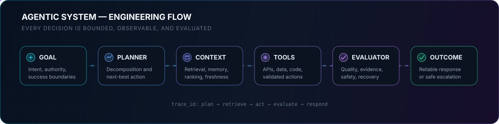
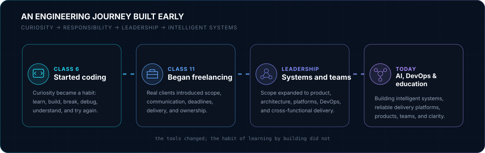

  

  
  
  
  
  
  

  
  
  

  
  

## Engineering Profile

I am a **Lead Full Stack Software Engineer, Product Owner, DevOps Engineer, founder, and technical educator**. My work sits where product decisions, application architecture, intelligent automation, cloud delivery, and engineering leadership meet.

I do more than implement isolated features. I turn incomplete ideas into clearly scoped systems, choose architectures that can evolve, lead delivery across teams, and keep reliability and operability visible from the beginning. My current technical direction goes deeper into **Agentic AI and AI engineering**: tool-using systems, retrieval, context design, evaluation, guardrails, observability, and production delivery.

<table>
  <tr>
    <td width="33%" valign="top">
      
      <h3>From ambiguity to product</h3>
      
I translate business intent into system boundaries, prototypes, delivery plans, and maintainable software—without losing sight of the user or the operating reality.

    </td>
    <td width="33%" valign="top">
      
      <h3>From model to system</h3>
      
I focus on the engineering around the model: orchestration, tools, memory, retrieval, structured decisions, evaluation, safety boundaries, and measurable reliability.

    </td>
    <td width="33%" valign="top">
      
      <h3>From commit to confidence</h3>
      
I design delivery paths that make software repeatable to build, secure to release, observable in production, and easier for teams to operate.

    </td>
  </tr>
</table>

  
<strong>Open my operating principles</strong>

   
  <table>
    <tr><td><strong>01 — Outcome before implementation</strong></td><td>Define the user, business, and reliability outcome before choosing tools or architecture.</td></tr>
    <tr><td><strong>02 — Prototype the risk</strong></td><td>Test the hardest assumption early; do not spend weeks polishing the easy parts.</td></tr>
    <tr><td><strong>03 — Architecture must earn its complexity</strong></td><td>Use the simplest boundary that protects change, ownership, scale, and operational clarity.</td></tr>
    <tr><td><strong>04 — Delivery is part of design</strong></td><td>Testing, security, deployment, rollback, monitoring, and ownership are system requirements.</td></tr>
    <tr><td><strong>05 — Explain the why</strong></td><td>Teams move faster when decisions and trade-offs are understandable, reviewable, and teachable.</td></tr>
  </table>

## Agentic AI & AI Engineering

  

  
  
  
  

<table>
  <tr>
    <td width="50%" valign="top">
      
      <h3>Reasoning, planning, and tool use</h3>
      
Decompose goals into bounded steps, choose tools through explicit contracts, preserve state deliberately, and make actions inspectable instead of hiding behaviour inside a single prompt.

    </td>
    <td width="50%" valign="top">
      
      <h3>Retrieval, memory, and context</h3>
      
Build the right context at the right moment using retrieval, structured memory, metadata, ranking, and clear rules for what should be remembered, refreshed, or ignored.

    </td>
  </tr>
  <tr>
    <td width="50%" valign="top">
      
      <h3>Evaluation, guardrails, and recovery</h3>
      
Define success cases, adversarial cases, quality signals, confidence thresholds, fallbacks, human review points, and traces that reveal why an agent made a decision.

    </td>
    <td width="50%" valign="top">
      
      <h3>Services, scale, and observability</h3>
      
Deliver AI capabilities as versioned services with secure secrets, asynchronous work, cost and latency controls, deployment safety, telemetry, and an operational feedback loop.

    </td>
  </tr>
</table>

  
<strong>Open the Agentic AI engineering playbook</strong>

   

  **System framing**

  - Define the agent’s goal, authority, prohibited actions, success criteria, and escalation path.
  - Separate deterministic application logic from probabilistic model decisions.
  - Give every tool a narrow schema, validation rules, timeouts, and observable outcomes.

  **Knowledge and state**

  - Design retrieval around document quality, chunk boundaries, metadata, ranking, freshness, and citations.
  - Treat memory as a product decision: decide what is durable, what is session-only, and what must expire.
  - Keep context compact and task-relevant so long workflows do not degrade into oversized chat history.

  **Quality and operations**

  - Evaluate complete trajectories, not only the final sentence: plan quality, tool choice, evidence, and recovery matter.
  - Trace model calls, tool calls, latency, token use, failure categories, and user-visible outcomes.
  - Introduce human approval wherever an action changes important external state or carries material risk.

## DevOps & Platform Engineering

  

  

  
  
  

| Platform area | Engineering depth |
|:--|:--|
| **Cloud and infrastructure** | Reproducible environments, infrastructure as code, secure configuration, least privilege, cost awareness, and clear environment boundaries. |
| **Containers and orchestration** | Container build discipline, Kubernetes workloads, health checks, resource controls, rollout strategies, scaling, and failure-aware service design. |
| **CI/CD and GitOps** | Automated validation, artifact promotion, policy gates, declarative deployments, rollback paths, and a reviewable change history. |
| **Observability and reliability** | Logs, metrics, traces, actionable alerts, service-level signals, incident diagnosis, and feedback from production into engineering priorities. |
| **Distributed and event-driven systems** | API boundaries, asynchronous processing, Kafka-based event flow, idempotency, retries, backpressure, and failure isolation. |

  
<strong>Open my production-readiness checklist</strong>

   

  - **Build:** reproducible dependency installation, small artifacts, immutable versions, and automated security checks.
  - **Test:** fast feedback first, contract and integration checks where boundaries matter, and realistic failure-path coverage.
  - **Release:** progressive rollout where justified, environment parity, explicit migrations, rollback plans, and ownership at launch.
  - **Operate:** health signals, dashboards built around decisions, alerts that lead to action, runbooks, and post-incident learning.
  - **Improve:** measure bottlenecks across developer experience, deployment speed, reliability, cost, and customer impact.

## Full Stack & Product Engineering

<table>
  <tr>
    <td width="25%" valign="top">
      
      
Accessible user flows, reusable components, state clarity, responsive interfaces, and UI behaviour that communicates system state honestly.

    </td>
    <td width="25%" valign="top">
      
      
Service boundaries, REST APIs, background processing, authentication, data modelling, integrations, performance, and maintainability.

    </td>
    <td width="25%" valign="top">
      
      
Discovery, scope, prioritisation, rapid prototyping, lifecycle ownership, stakeholder alignment, delivery, and post-launch learning.

    </td>
    <td width="25%" valign="top">
      
      
Architecture decisions, mentoring, cross-functional coordination, technical communication, delivery accountability, and raising team clarity.

    </td>
  </tr>
</table>

## Technology Constellation

  
<strong>Languages and application engineering</strong>

   
  

      
    
  

  
<strong>Cloud, DevOps, observability, and delivery</strong>

   
  

      
    
    
  

  
<strong>Data, machine learning, and AI engineering</strong>

   
  

      
    
    
    
    
    
    
    
    
    
    
  

  
<strong>Leadership and product capabilities</strong>

   
  

    
    
    
    
    
    
  

  
<strong>Creative, design, and media capabilities</strong>

   
  

      
    
    
    
  

## Engineering Journey

  

  
<strong>Open the story behind the timeline</strong>

   

  **Class 6 — curiosity became a craft**  
  I started coding in Class 6. What began as curiosity about how computers followed instructions gradually became a habit of learning by building, breaking, and trying again.

  **Class 11 — responsibility arrived early**  
  I began freelancing in Class 11. Working for real people changed the meaning of software: requirements could be incomplete, communication mattered, timelines were real, and “working on my machine” was not the finish line.

  **Professional engineering — systems and teams**  
  Over time my scope moved from individual implementation to full-stack architecture, product ownership, cloud infrastructure, DevOps, cross-functional coordination, and technical leadership.

  **Today — intelligent systems and knowledge sharing**  
  Today I combine product engineering, Agentic AI, DevOps, and education. I build systems, develop teams, and explain difficult technical concepts through CodersAura so that understanding—not jargon—becomes the advantage.

## Professional Scope

<table>
  <tr>
    <td width="50%" valign="top">
      
      
Architecture and hands-on delivery across frontend, backend, data, integrations, quality, performance, and maintainability.

    </td>
    <td width="50%" valign="top">
      
      
End-to-end product lifecycle ownership: discovery, prioritisation, prototyping, team alignment, execution, launch, and iteration.

    </td>
  </tr>
  <tr>
    <td width="50%" valign="top">
      
      
Infrastructure automation, container platforms, GitOps, delivery pipelines, reliability, monitoring, and operational improvement.

    </td>
    <td width="50%" valign="top">
      
      
Entrepreneurial product exploration with a focus on useful experiences, technical execution, rapid learning, and ownership.

    </td>
  </tr>
</table>

## Creator Ecosystem

<table>
  <tr>
    <td width="50%" valign="top">
      
      <h3>Technical clarity through memorable analogies</h3>
      
CodersAura explains DSA, Python, web engineering, system design, Kubernetes, DevOps, RAG, Agentic AI, MCP, and modern developer workflows in clear Hinglish—built for understanding that lasts.

      
    </td>
    <td width="50%" valign="top">
      
      <h3>Animated stories about the human mind</h3>
      
FrayedMinds explores psychology, relationships, emotional healing, manipulation, moral dilemmas, and human behaviour through thoughtful 2D animated storytelling.

      
    </td>
  </tr>
</table>

## GitHub Activity

  

 

  

 

  

<picture>
  <source media="(prefers-color-scheme: dark)" srcset="https://raw.githubusercontent.com/yaduvanshinitishkumar/yaduvanshinitishkumar/output/github-contribution-grid-snake-dark.svg" />
  <source media="(prefers-color-scheme: light)" srcset="https://raw.githubusercontent.com/yaduvanshinitishkumar/yaduvanshinitishkumar/output/github-contribution-grid-snake.svg" />
  
</picture>

  <strong>One public record, one consistent story.</strong> Thresholds in the dashboard are conservative snapshots; the live summary and contribution animation continue to update from GitHub.

---

  
  
    
  <strong>Architect with purpose. Automate with discipline. Operate with evidence. Teach with clarity.</strong>

